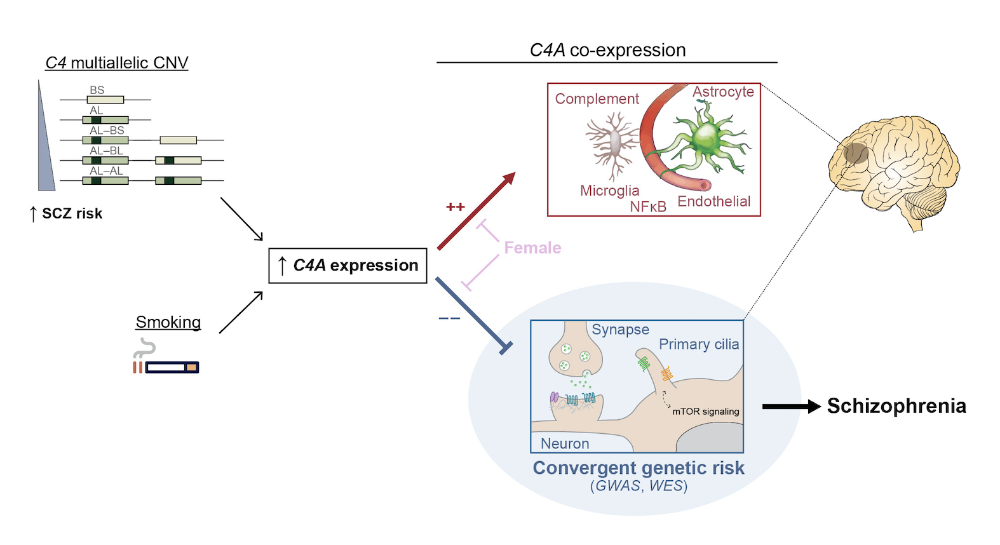
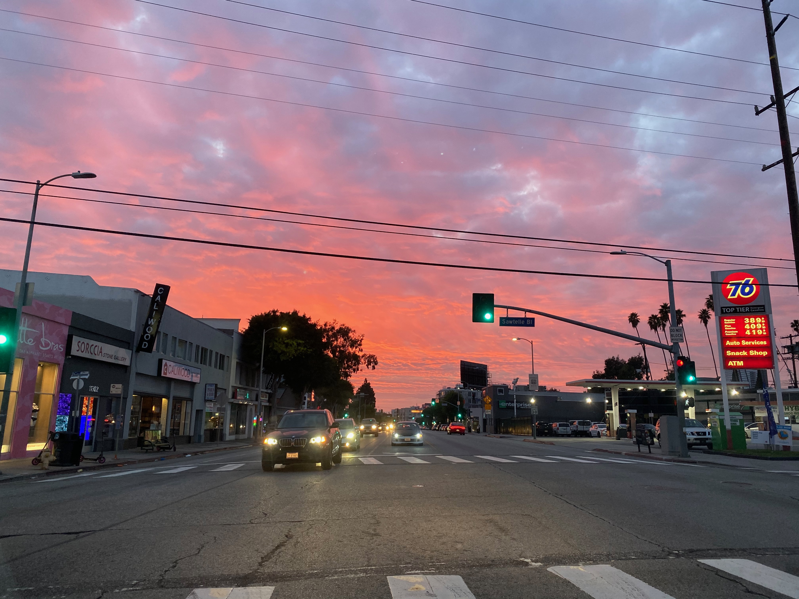
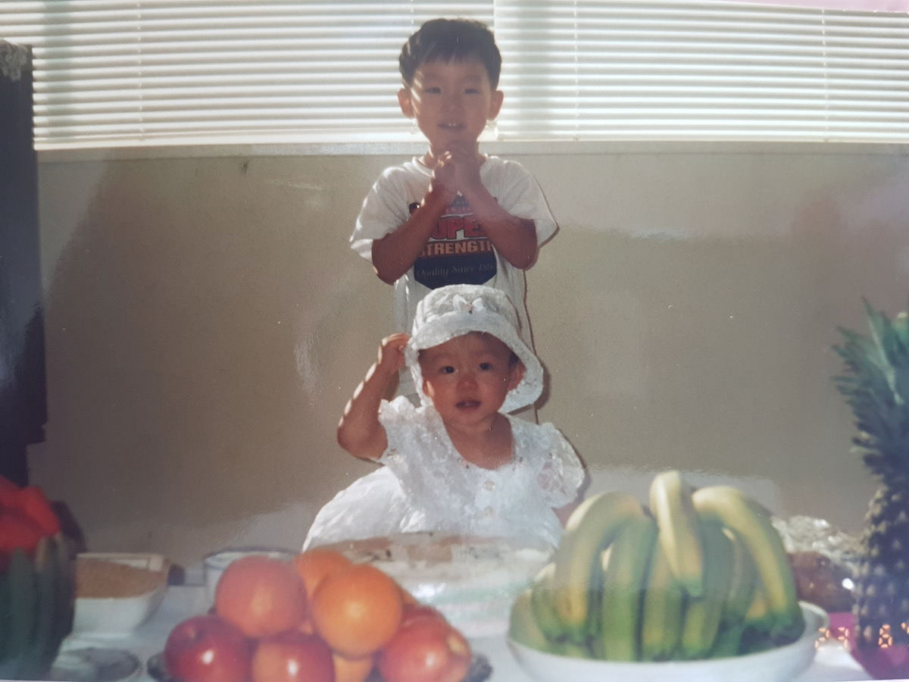
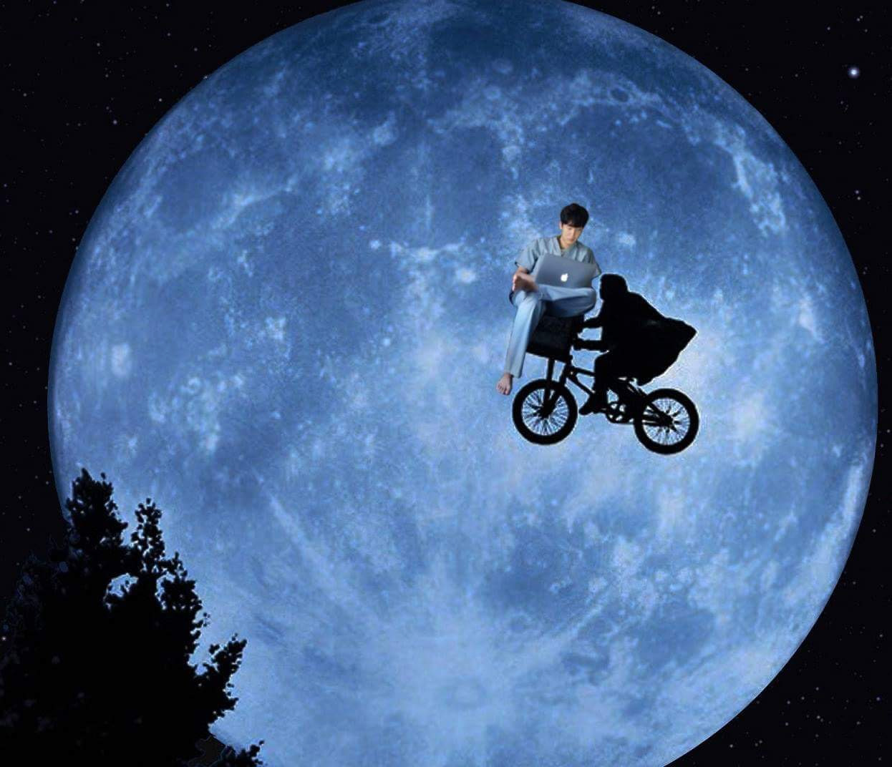
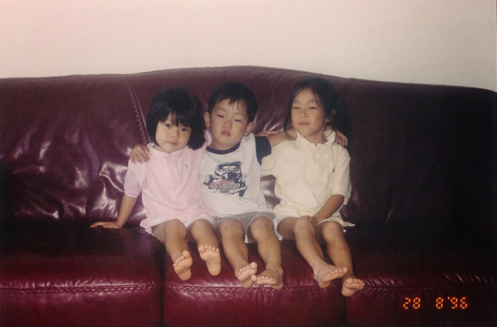
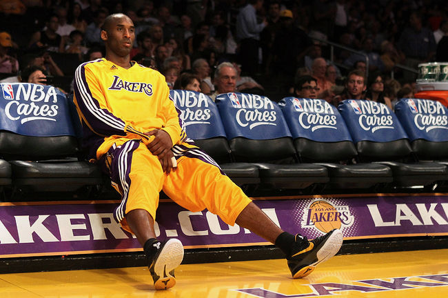
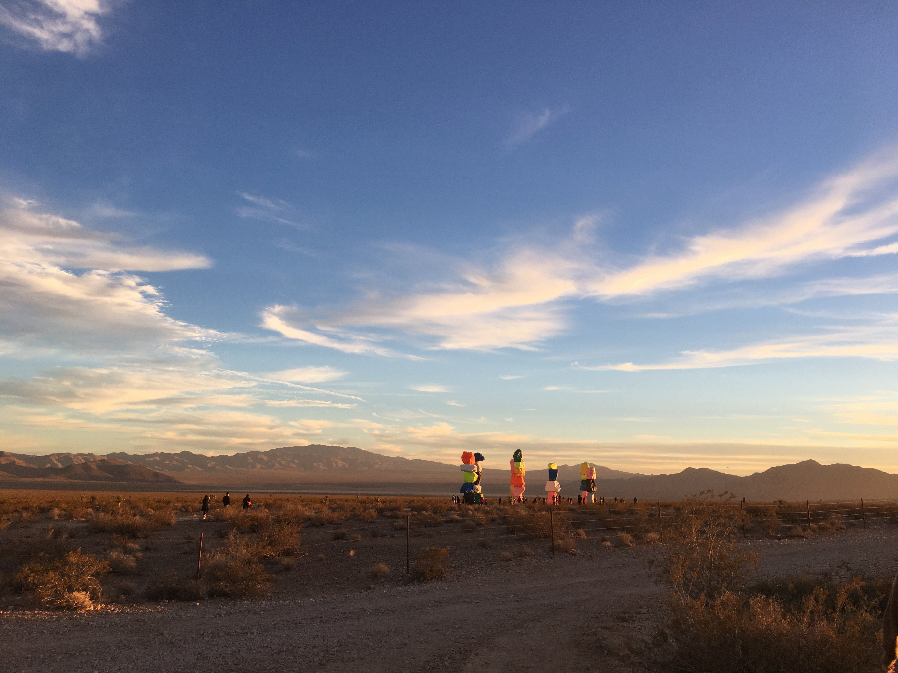
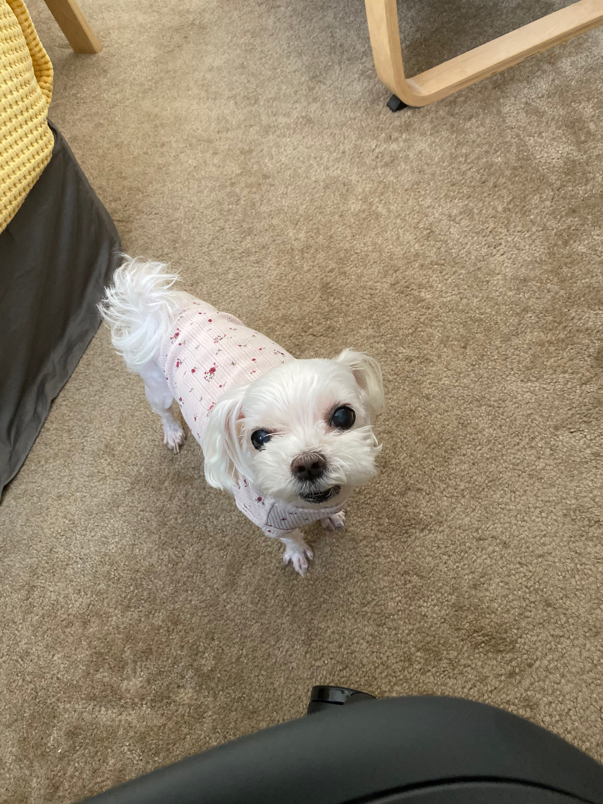
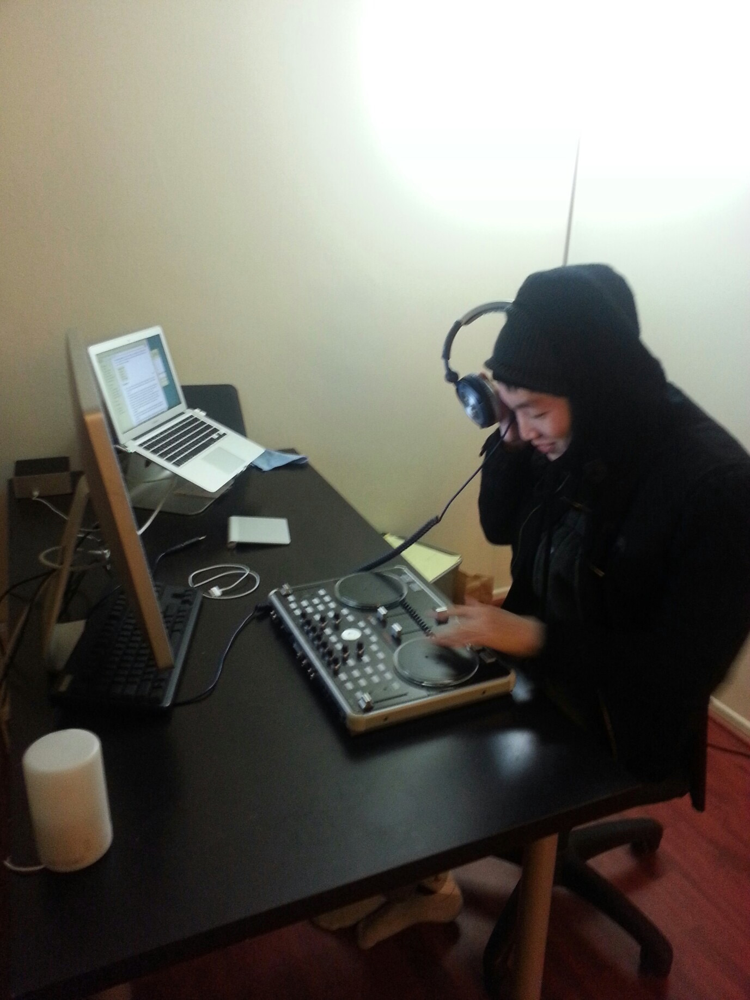
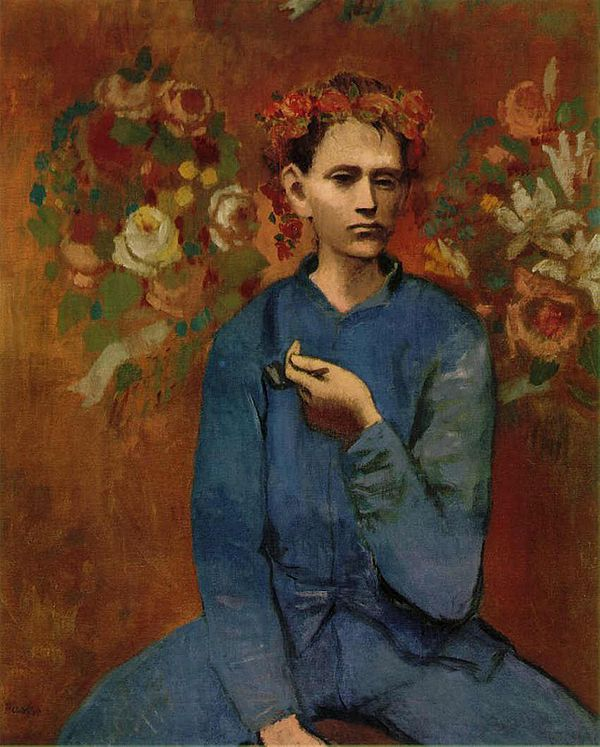


 
The course will cover the basics of quantitative genetics including: genetic basis for complex traits, population genetic assumptions including Fisher’s variance decomposition, covariance between relatives, calculation of the numerator relationship matrix based on IBD alleles and an arbitrary pedigree, the genomic relationship matrix based on AIS alleles, heritability in the broad and narrow sense, inbreeding and crossbreeding, and response to selection. Also an introduction to advanced topics such as: Genome Wide Association Analysis (GWAS), QTL mapping, correlated characters; and the multivariate response to selection

The course will cover the basics of quantitative genetics including: genetic basis for complex traits, population genetic assumptions including Fisher’s variance decomposition, covariance between relatives, calculation of the numerator relationship matrix based on IBD alleles and an arbitrary pedigree, the genomic relationship matrix based on AIS alleles, heritability in the broad and narrow sense, inbreeding and crossbreeding, and response to selection. Also an introduction to advanced topics such as: Genome Wide Association Analysis (GWAS), QTL mapping, correlated characters; and the multivariate response to selection

 

 

 

 

 

 

 

 

 
comme des garcon a la pipe
